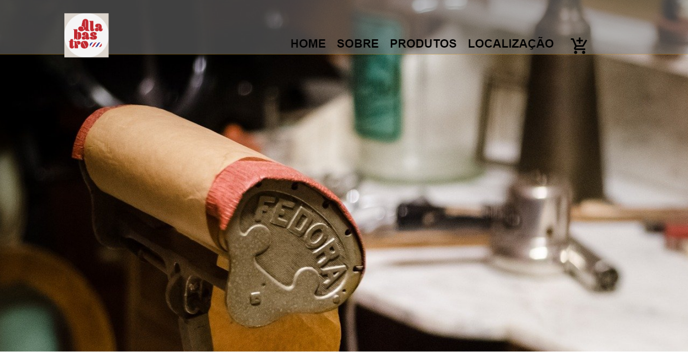

# Barbearia Alabastro

## Tecnologias
HTML, CSS, JavaScript e PHP.

## Descrição
Projeto acadêmico feito para universidade, onde foi feito uma página de uma barbearia.

## Uso
Não há funcionalidades reais, apenas um exercício para desenvolver meus conhecimentos.

## Autor
Lucas Benini de Andrade

## Informações Adicionais
Exige o ambiente WAMP para que seja possível total visualização e efetividade do projeto.
